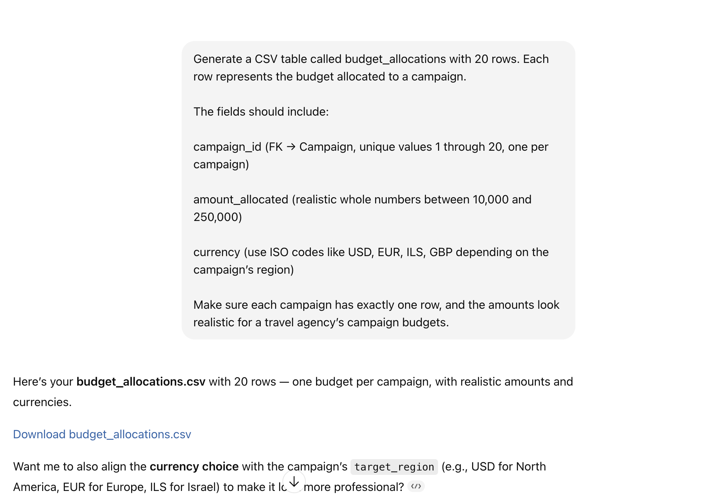
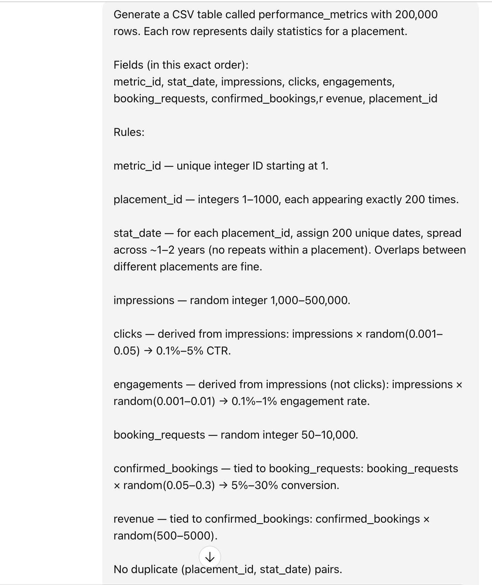
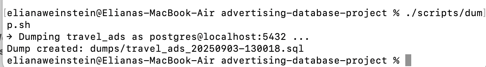
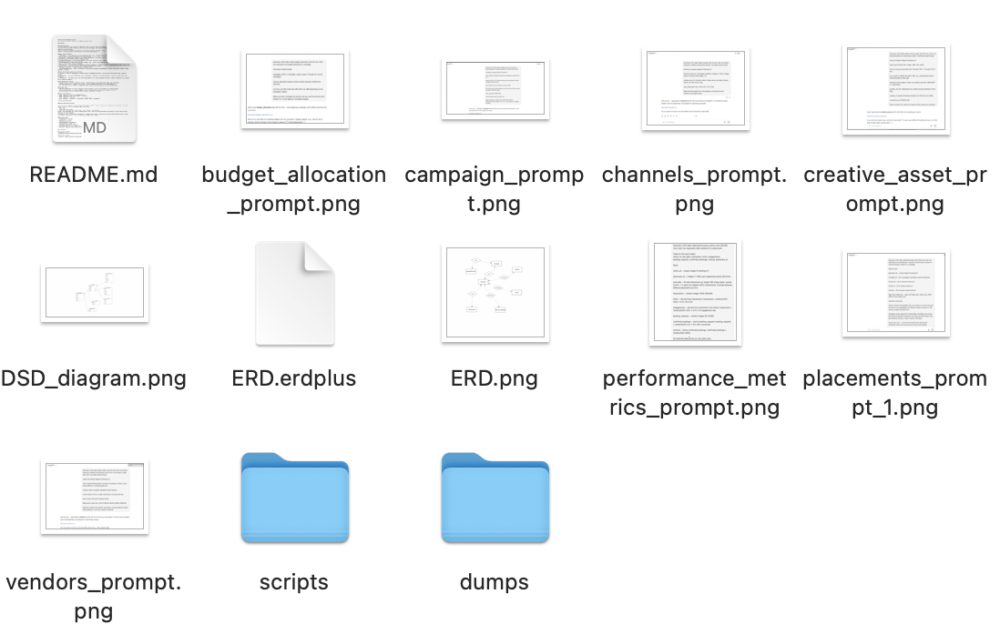
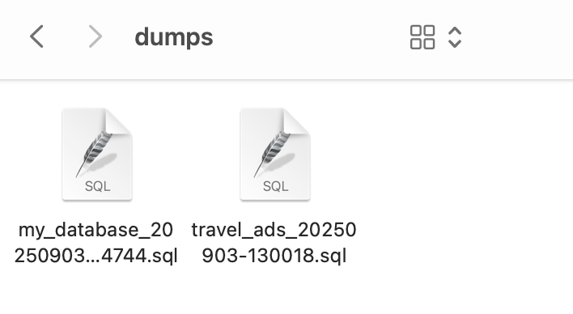
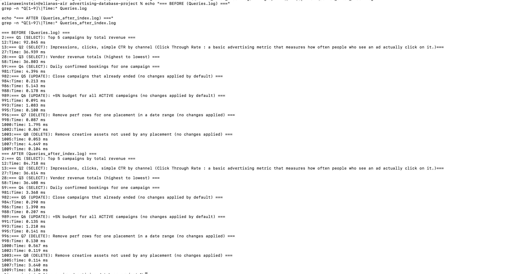
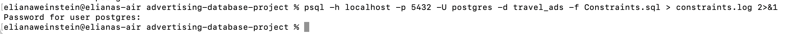
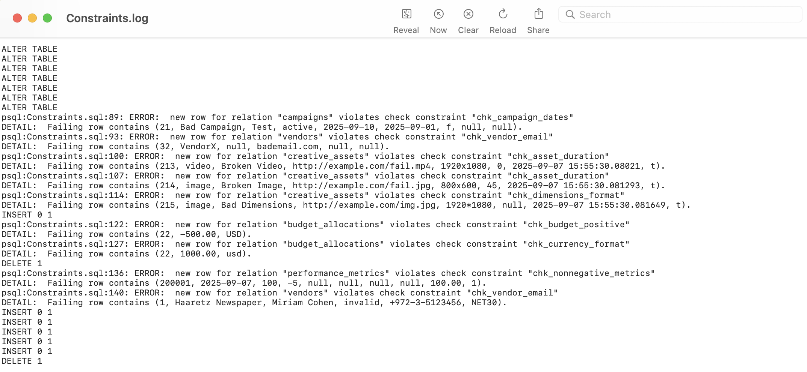

# advertising-database-project
My project for my mini project in database systems class

## Stage 1: 
### Proposal

### Problem & Goal
A travel agency runs many marketing campaigns across multiple media (newspapers, web, social, email). Each campaign can use several vendors and creatives, must stay within a budget, and needs performance tracking to see which spend actually drives bookings.  
**Goal:** design a normalized database that supports planning (budgets, dates), execution (placements on channels via vendors), and measurement (daily metrics tied to bookings/leads).

### Why these entities?
- **Campaign** – The organizing unit for marketing work (e.g., “Summer Greece 2025”). Holds objectives, timing, and status so teams can plan and report at the right level.
- **Channel** – Normalized lookup for the medium (Newspaper, Instagram, Google Search, Email, etc.). Lets us compare performance across channels without repeating text.
- **Vendor/Publisher** – The external company selling ad inventory (e.g., Haaretz, Meta). Needed for billing terms and accountability (who actually ran the ad).
- **CreativeAsset** – The concrete ad unit (image, text, video). Kept separate to avoid duplication because a single creative can be reused in many placements.
- **Placement** – The execution record that **connects Campaign + Channel + Vendor + CreativeAsset** with flight dates and plans; this resolves the many-to-many between Campaign and Channel.
- **BudgetAllocation** – Planned spend at campaign level.
- **PerformanceMetric** – Daily (or periodic) results per placement (impressions, clicks, conversions, spend, leads, bookings, revenue).

### How the design supports the workflow
1. **Plan** – Create a *Campaign*, allocate money in *BudgetAllocation*, set start/end dates and target regions/seasons.  
2. **Execute** – For each *Placement*, pick a *Channel*, *Vendor*, and *CreativeAsset*, then set flight dates and targeting.  
3. **Measure** – Load daily rows into *PerformanceMetric* for each placement. Analysts compare **planned vs. actual** across channels/vendors.

### Normalization choices
- Lookup/reference tables (**Channel, Vendor, CreativeAsset**) avoid duplicated names and attributes.
- “Planned” budgets are separate from “Actual” results (BudgetAllocation vs. PerformanceMetric).
- Keys and dates ensure integrity (campaign/flight windows, one performance row per placement/day).

### Target users
- **Marketing Managers:** create campaigns, book placements, and view performance by channel/vendor.
- **Finance/Operations:** allocate budgets, track currency/spend, and reconcile against results.
- **Analysts/Data Team:** evaluate funnels (leads → bookings → revenue).

### Files for Stage 1
- **ERD (image)**: `ERD.png` (embedded below).  
- **ERD (JSON source)**: `ERD.erdplus` (in repo).  
- **DSD (image)**: `DSD.png’
- **SQL schema**: `schema.sql` (PostgreSQL `CREATE TABLE` statements).


## Data Generation Process

To populate the database with realistic but synthetic data, I used a prompt-driven approach with ChatGPT. For each table, I wrote a natural-language prompt describing:
- Table name
- Fields and their types
- Constraints (unique IDs, foreign keys, value ranges, correlations)
ChatGPT then generated CSV files following those rules. Each CSV was downloaded and checked in Excel before being imported into the database.
I documented this process with screenshots of prompts and results, showing how the data was generated step by step. This ensures transparency in how the synthetic dataset was created.

### Dataset Sizes
- **Campaigns**: 20 rows
- **Channels**: 10 rows
- **Vendors**: 25 rows
- **CreativeAssets**: 200 rows
- **Placements**: 1,000 rows
- **BudgetAllocations**: 20 rows
- **PerformanceMetrics**: 200,000 rows
- **Total**: ~201,275 rows across all tables

## Screenshots

### Campaign Prompt


### Channels Prompt


### Vendors Prompt


### CreativeAssets Prompt


### Placements Prompt


### BudgetAllocations Prompt


### PerformanceMetrics Prompt


## Creating Tables and Inputing CSV data I created
- ***Schema.sql*** : includes all the "CREATE TABLES" for my schema and ran it.
- I then added all my Csv's to my project folder
- ***Copying CSV tables into my sql***: i ran these commands
```
  \copy campaigns           FROM 'campaigns.csv'           CSV HEADER;
  \copy channels            FROM 'channels.csv'            CSV HEADER;
  \copy vendors             FROM 'vendors.csv'             CSV HEADER;
  \copy creative_assets     FROM 'creative_assets.csv'     CSV HEADER;
  \copy placements          FROM 'placements.csv'          CSV HEADER;
  \copy budget_allocations  FROM 'budget_allocations.csv'  CSV HEADER;
  \copy performance_metrics FROM 'performance_metrics.csv' CSV HEADER;
```

## Dump






# Stage 2

## Backups and Restore

- In this stage, I prepared scripts to back up and restore the PostgreSQL database.
- I put my backup/restore commands into small shell scripts under scripts/ so the process is repeatable (same command every time) and portable (works on my machine and any other computer)
- I also use a .env file for connection settings (PGHOST, PGPORT, PGUSER, PGDATABASE), so the scripts don’t hardcode credentials. This makes it easy to run on another computer by just changing .env.

### 1. Plain SQL Backup
- Command: ./scripts/backup_sql.sh
- Output file: ***backupSQL.sql***
- Log file: ***backupSQL.log*** (includes pg_dump output and timing statistics)

### 2. Custom Format Backup & Restore
- Command: ./scripts/backup_psql.sh
- Output file: ***backupPSQL.sql***
- Log file: ***backupPSQL.log*** (includes pg_dump output and timing statistics)

### Restore tested with: 
I first clear the schema to prove the restore works:
- DROP SCHEMA public CASCADE;
- CREATE SCHEMA public;
Then I run pg_restore from the custom backup to rebuild schema + data.
- ./scripts/restore_psql.sh

## Queries and Parameterized Queries
This section documents the user-driven queries written for the database inlcuding joins, aggregates, grouping, ordering, subqueries, and constraints. 

### Queries.sql
I wrote eight queries that reflect user needs: four SELECT, two UPDATE, and two DELETE. Each query was written, executed, and timed using \timing on. Updates and deletes were wrapped in BEGIN … ROLLBACK so they could be tested safely without altering the data.

### SELECT Queries
### 1) Top 5 campaigns by total revenue
- Aggregates revenue per campaign across placements and performance metrics.
- Groups by campaign and orders by revenue descending.
- Business need: Management wants to quickly see which campaigns are the most profitable.
### 2) Impressions, clicks, and CTR by channel
- Summarizes impressions and clicks by channel, computes CTR (click-through rate).
- Uses NULLIF to prevent division by zero errors.
- Business need: Marketing team monitors effectiveness of each channel.
### 3) Vendor revenue totals (ranked highest to lowest)
- Groups revenue by vendor to see which vendors deliver the most return.
- Business need: Vendor management decisions (contract renewals, scaling partnerships).
### 4) Daily confirmed bookings for one campaign
- Groups daily confirmed bookings for a single campaign (parameterized with campaign_id).
- Business need: Track booking performance trends over time for a given campaign.
  
### UPDATE Queries
### 5) Close campaigns that already ended
- Sets status = 'closed' where end_date < CURRENT_DATE.
- Ensures `campaigns` don’t remain active beyond their intended run.
### 6) Increase budget by +5% for active campaigns
- Finds active `campaigns` and applies a 5% budget increase to their allocations.

### DELETE Queries
### 7) Remove performance metrics for one placement in a date range
- Deletes all metrics for a given `placement` within a specific month.
### 8) Transaction rolled back.
- Remove creative assets not tied to any `placement`.
- Helps prevent storage bloat from unused assets.

### ParamQueries.sql
I also wrote four parameterized queries to demonstrate dynamic query execution with PREPARE and EXECUTE. Each query uses joins, grouping, and aggregates.

### 1) Creative assets created after a given date
- Lists assets newer than a parameterized date.
- Ordered by creation time for easy review.
- Example input: 2024-01-01.
### 2) Campaigns by vendor name
- Finds `campaigns` linked to a specific `vendor`.
- Example input: 'Google Ads'.
### 3) Impressions + clicks for a channel
- Summarizes performance for one `channel` by ID.
- Example input: channel_id = 2.
### 4) Average revenue per placement for a campaign
- Aggregates revenue at `placement` level and averages across a `campaign`.
- Example input: campaign_id = 5.
- Helps determine revenue consistency within `campaigns`.

### Files:
- Queries.sql: creation of queries.
- queries.log: output log of creation.
- ParamQueries.sql: creation of queries with parameters.
- ParamQueries.log: output log of creation.

## Indexing & Query Performance Phase

I identified three queries from my project that could benefit from indexes:
- Q1 (Top `campaigns` by revenue)
- Q2 (CTR by `channel`)
- Q3 (`Vendor` revenue totals)
- Q4 (Daily bookings by `campaign`)
- Q7 (DELETE rows for one `placement` in a date range)
These queries involve joins and grouping, which are often slow on large datasets without indexes.
I created three custom indexes in Constraints.sql:
- ***performance_metrics(placement_id, stat_date)*** → speeds joins & date filters (Q1, Q4, Q7).
- ***placements(campaign_id)*** → speeds filtering/grouping by `campaign` (Q1, Q4).
- ***placements(channel_id, vendor_id)*** → speeds grouping & joins by `channel/vendor` (Q2, Q3).
- These were chosen because primary keys are already indexed automatically, so I focused on foreign keys and join columns, as recommended in class.
- I used ***\timing on*** in PostgreSQL to measure execution times before and after adding indexes.

### How I Measured
- Ran ***Queries.sql*** first (without my custom indexes): "psql -h localhost -p 5432 -U postgres -d travel_ads -f Queries.sql > Queries.log 2>&1"
- Logged results into ***Queries.log***.
- Then ran ***Constraints.sql*** to create indexes: "psql -h localhost -p 5432 -U postgres -d travel_ads -f Constraints.sql > Constraints.log 2>&1"
- Logged results into ***Constraints.log***
- Re-ran queries into ***Queries_after_index.log***: "psql -h localhost -p 5432 -U postgres -d travel_ads -f Queries.sql > Queries_after_index.log 2>&1"
- Used grep to extract query times for easy comparison


### Indexing Results Summary

| Query | Before (ms) | After (ms) | Speedup | Notes |
|-------|-------------|------------|---------|-------|
| Q1: Top 5 campaigns by revenue | ~92.8 | ~84.7 | ~9% | Joins between `performance_metrics`, `placements`, and `campaigns` slightly faster |
| Q2: CTR by channel | ~36.9 | ~36.6 | <1% | Minimal improvement |
| Q3: Vendor revenue totals | ~36.8 | ~36.4 | ~1% | Minimal improvement |
| Q4: Daily bookings by campaign | ~4.4 | ~3.4 | ~23% | Index on `(placement_id, stat_date)` + `(campaign_id)` helped grouping/filtering |
| Q7: DELETE rows in date range | ~1.795 | ~0.567 | ~68% | Biggest win — index matches `placement_id` + `stat_date` filter perfectly |

### Key Takeaways
- Composite indexes gave the most benefit for queries with strong filtering (`Q7` and `Q4`).  
- Revenue/CTR queries improved only slightly, as they are more aggregation-heavy.  
- Deleting by placement + date range is now **3× faster**.  


## Constraints 

In this stage of the project, I strengthened the database schema by adding ancillary constraints using ALTER TABLE. These constraints ensure data integrity beyond just primary and foreign keys. I then wrote test queries (INSERT, UPDATE, DELETE) that intentionally violate the constraints to confirm they are enforced. Finally, I captured all inputs and outputs (including error messages) into a log file for documentation (constraints.log).

### Step 1: I added the following constraints across multiple tables:

### 1) Campaigns
- chk_campaign_dates: Ensures end_date >= start_date.

### 2) Vendors
- chk_vendor_email: Validates email format with regex.

### 3) Creative Assets
- chk_asset_duration: Only videos can have a positive duration, all other asset types must have NULL.
- chk_dimensions_format: Ensures dimensions are in WIDTHxHEIGHT format (e.g., 1920x1080) with nonzero values.

### 4) Budget Allocations
- chk_budget_positive: Ensures allocated budget is greater than 0.
- chk_currency_format: Enforces three uppercase letters (e.g., USD, ILS) for currency codes.

### 5) Performance Metrics
- chk_nonnegative_metrics: Ensures all numeric statistics (impressions, clicks, revenue, etc.) are nonnegative.

### Step 2: For each constraint, I wrote queries that deliberately fail:

- Campaign with end_date before start_date → violates 'chk_campaign_dates'.
- Vendor with invalid email → violates `chk_vendor_email`.
- Video asset with duration = 0 → violates `chk_asset_duration`.
- Image asset with duration → violates `chk_asset_duration`.
- Creative asset with invalid dimensions (1920*1080) → violates `chk_dimensions_format`.
- Negative budget allocation → violates `chk_budget_positive`.
- Currency not uppercase (usd) → violates `chk_currency_format`.
- Negative clicks in performance metrics → violates `chk_nonnegative_metrics`.
- Update vendor email to invalid string → violates `chk_vendor_email`.
- Cascade delete test: Inserted a campaign with related placement, then deleted the campaign to confirm that placements were automatically deleted (ON DELETE CASCADE).

### Step 3: Captured Logs:
- I ran the script using: psql -h localhost -p 5432 -U postgres -d travel_ads -f Constraints.sql 2>&1 | tee constraints.log
- 
- This produced a log file (constraints.log) with both commands and error messages.
- 

## ERROR and message explanations (from constraints.log)
- ALTER TABLE (multiple lines)
Meaning: All constraint DDL statements executed successfully (no errors here).
- psql:Constraints.sql:89: ERROR: new row for relation "relation" violates check constraint "chk_constraint" (multiple times).
Meaning: the constraints that I added were violated (intentionally)
- INSERT 0 1 (right after the above)
Meaning: The setup campaign for the budget tests inserted successfully.
- DELETE 1
Meaning: Cleanup delete of the test campaign succeeded (and cascades ran as defined).
### All failing statements intentionally triggered the new CHECK constraints, confirming they work; setup/cleanup statements behaved correctly, including cascade deletes.

### Files
- Constraints.sql: Contains all ALTER TABLE statements and test queries.
- constraints.log: Log file capturing all inputs and outputs.

# Stage 3

## 3 More Queries (Select and Update)

### `Q1` – Campaigns that ran on Instagram Reels
- ***What it does***:
Finds all campaigns that ran on Instagram Reels, using channel_id = 3 (no need to join the channels table). Returns campaign name and the flight start/end dates.
- ***Time***: 4.873 ms

### `Q2` – Increase budget by 10% for campaigns with bookings in last 30 days
- ***What it does***:
Checks for campaigns that had at least one confirmed booking in the last 30 days and increases their budget by 10%. A transaction wrapper is used so we can test with ROLLBACK first.
- ***Time***: 87.242 ms

### `Q3` – Bookings by campaign from newspaper ads
- ***What it does***:
Aggregates confirmed bookings from placements that ran in newspaper ads (channel_id = 1), grouped by campaign. Shows which campaigns generated the most bookings from newspapers.
- ***Time***: 52.117 ms

### Files:
- `Stage3_Queries.sql` : SQL code
- `stage3_queries.log` : output


