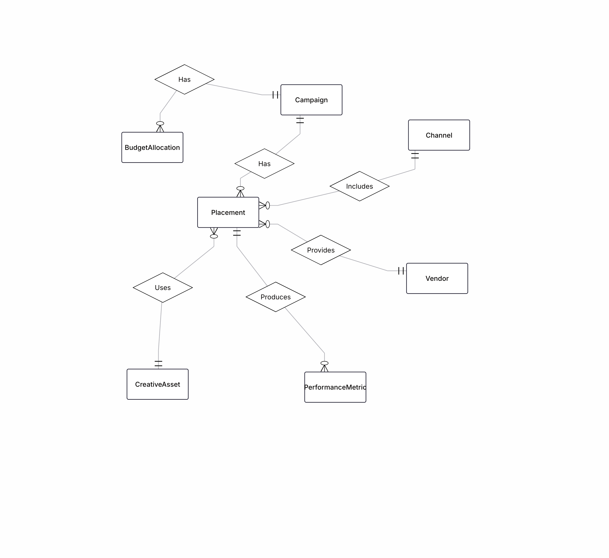
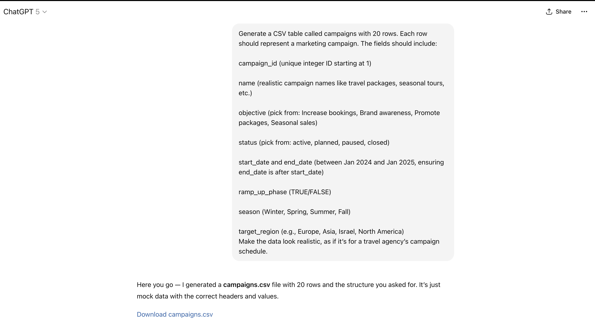
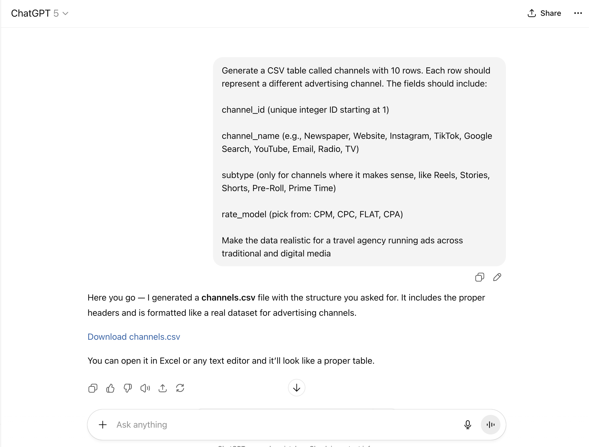
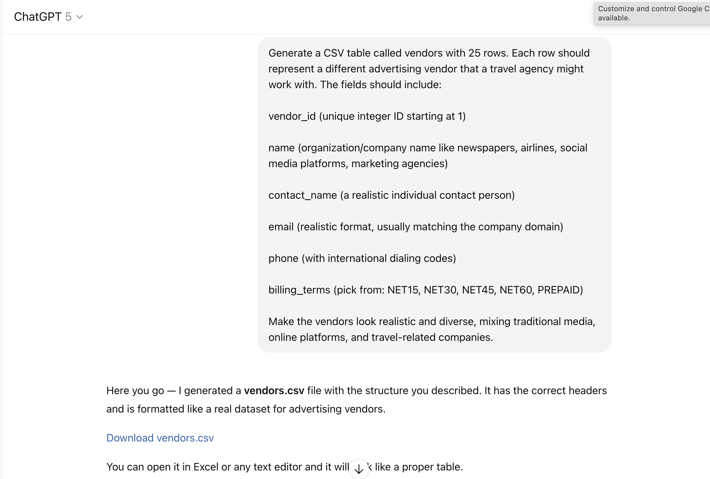
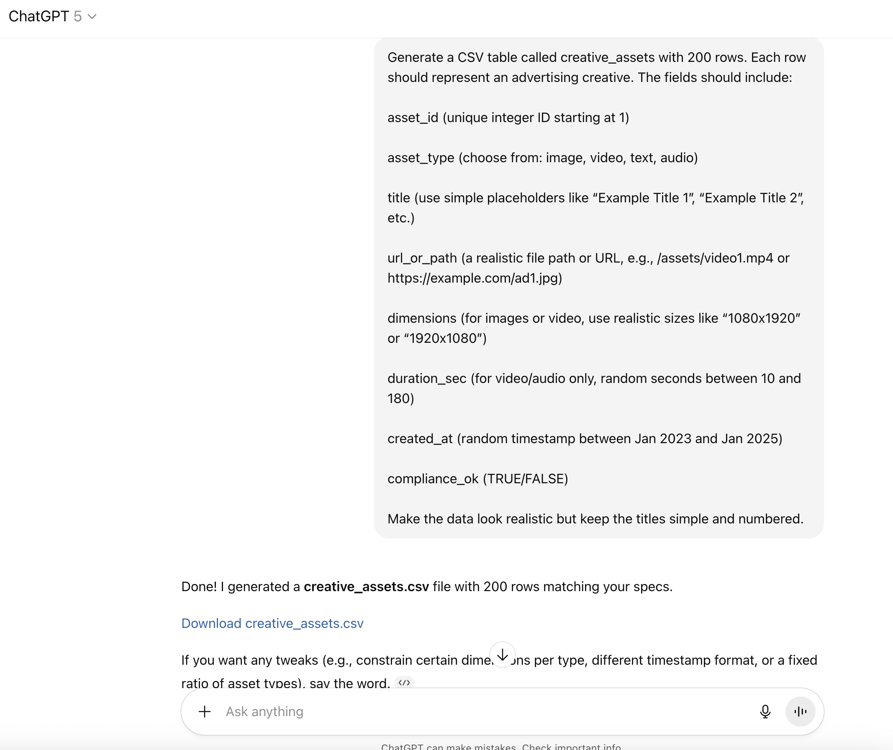
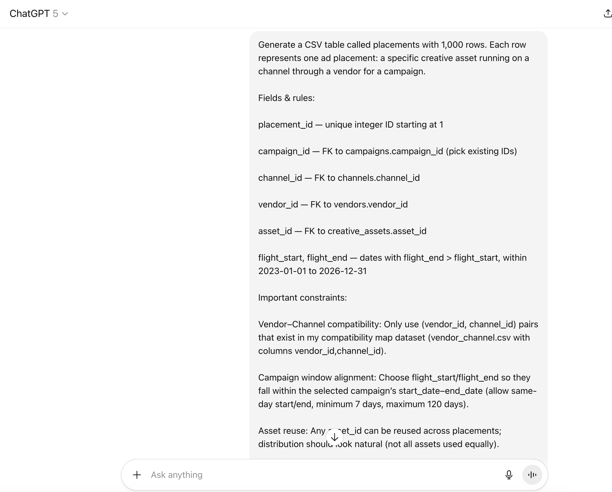
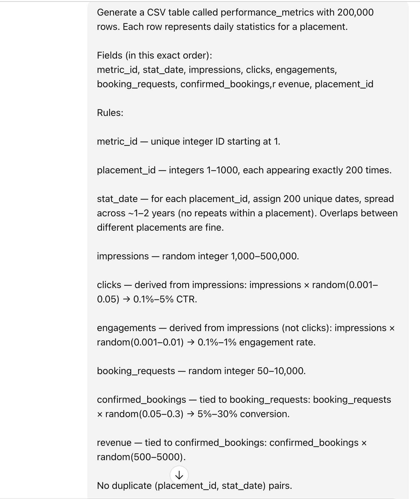

# advertising-database-project
My project for my mini project in database systems class

## Proposal

### Problem & Goal
A travel agency runs many marketing campaigns across multiple media (newspapers, web, social, email). Each campaign can use several vendors and creatives, must stay within a budget, and needs performance tracking to see which spend actually drives bookings.  
**Goal:** design a normalized database that supports planning (budgets, dates), execution (placements on channels via vendors), and measurement (daily metrics tied to bookings/leads).

### Why these entities?
- **Campaign** – The organizing unit for marketing work (e.g., “Summer Greece 2025”). Holds objectives, timing, and status so teams can plan and report at the right level.
- **Channel** – Normalized lookup for the medium (Newspaper, Instagram, Google Search, Email, etc.). Lets us compare performance across channels without repeating text.
- **Vendor/Publisher** – The external company selling ad inventory (e.g., Haaretz, Meta). Needed for billing terms and accountability (who actually ran the ad).
- **CreativeAsset** – The concrete ad unit (image, text, video). Kept separate to avoid duplication because a single creative can be reused in many placements.
- **Placement** – The execution record that **connects Campaign + Channel + Vendor + CreativeAsset** with flight dates and plans; this resolves the many-to-many between Campaign and Channel.
- **BudgetAllocation** – Planned spend at campaign level.
- **PerformanceMetric** – Daily (or periodic) results per placement (impressions, clicks, conversions, spend, leads, bookings, revenue).

### How the design supports the workflow
1. **Plan** – Create a *Campaign*, allocate money in *BudgetAllocation*, set start/end dates and target regions/seasons.  
2. **Execute** – For each *Placement*, pick a *Channel*, *Vendor*, and *CreativeAsset*, then set flight dates and targeting.  
3. **Measure** – Load daily rows into *PerformanceMetric* for each placement. Analysts compare **planned vs. actual** across channels/vendors.

### Normalization choices
- Lookup/reference tables (**Channel, Vendor, CreativeAsset**) avoid duplicated names and attributes.
- “Planned” budgets are separate from “Actual” results (BudgetAllocation vs. PerformanceMetric).
- Keys and dates ensure integrity (campaign/flight windows, one performance row per placement/day).

### Target users
- **Marketing Managers:** create campaigns, book placements, and view performance by channel/vendor.
- **Finance/Operations:** allocate budgets, track currency/spend, and reconcile against results.
- **Analysts/Data Team:** evaluate funnels (leads → bookings → revenue).

### Files for Stage 1
- **ERD (image)**: `ERD.png` (embedded below).  
- **ERD (JSON source)**: `ERD.erdplus` (in repo).  
- **DSD (image)**: `DSD.png’
- **SQL schema**: `schema.sql` (PostgreSQL `CREATE TABLE` statements).

### Data Generation Process

To populate the database with realistic but synthetic data, I used a prompt-driven approach with ChatGPT. For each table, I wrote a natural-language prompt describing:
- Table name
- Fields and their types
- Constraints (unique IDs, foreign keys, value ranges, correlations)
ChatGPT then generated CSV files following those rules. Each CSV was downloaded and checked in Excel before being imported into the database.
I documented this process with screenshots of prompts and results, showing how the data was generated step by step. This ensures transparency in how the synthetic dataset was created.

### Dataset Sizes
- **Campaigns**: 20 rows
- **Channels**: 10 rows
- **Vendors**: 25 rows
- **CreativeAssets**: 200 rows
- **Placements**: 1,000 rows
- **BudgetAllocations**: 20 rows
- **PerformanceMetrics**: 200,000 rows
- **Total**: ~201,275 rows across all tables

## Screenshots

### Campaign Prompt

### Channels Prompt

### Vendors Prompt

### CreativeAssets Prompt

### Placements Prompt

### BudgetAllocations Prompt

### PerformanceMetrics Prompt

